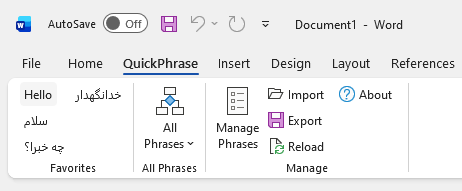
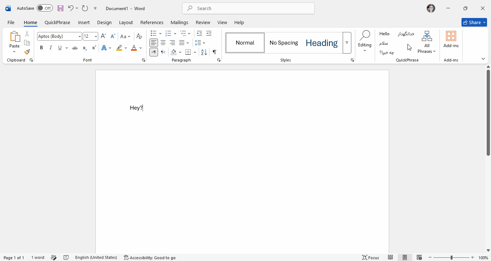
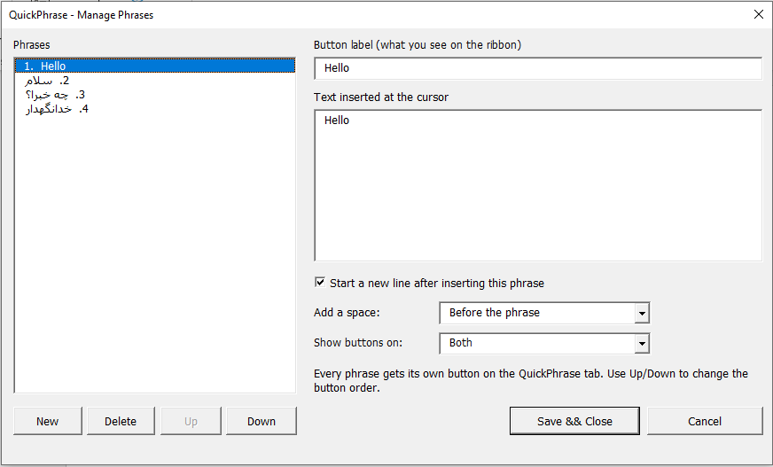
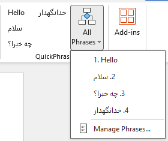
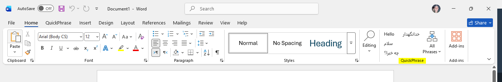

<div align="center">

# QuickPhrase

### Insert your frequently used phrases into Microsoft Word with one click

**A free, open-source Word add-in that turns your most-typed sentences into ribbon buttons.**
Click a button, the text appears at your cursor. No clipboard, no retyping, no dialogs.

[](https://github.com/cenaav/QuickPhrase/actions/workflows/ci.yml)
[](https://github.com/cenaav/QuickPhrase/releases)
[](https://github.com/cenaav/QuickPhrase/releases)
[](LICENSE)
[](#compatibility)
[](#compatibility)

**English** · [فارسی](#فارسی)

<br>

### [⬇ Download for Windows](https://github.com/cenaav/QuickPhrase/releases/latest)

**Unzip → close Word → double-click `Install.bat` → done.**
No admin rights. No installer. No account.

<br>

[Install guide](#install) ·
[How to use](#how-to-use-it) ·
[Screenshots](#screenshots) ·
[FAQ](#faq) ·
[Build from source](#building-from-source)

</div>

---

## The problem

If your job involves Word, you retype the same text all day. Sign-offs. Standard clauses. Diagnoses. Disclaimers. A greeting in Persian. A patient instruction. A refund policy paragraph.

Word's own answers each ask something of you first:

- **AutoCorrect** needs you to memorise a trigger abbreviation.
- **AutoText / Quick Parts** needs you to remember a name, then navigate a gallery.
- **Copy-paste from a scratch document** needs a second window and destroys your clipboard.
- **Third-party text expanders** need a background process, an account, or a subscription.

Each one puts a lookup between you and the text. QuickPhrase removes it: your phrases are *visible*, sitting on the ribbon as labelled buttons. You point and click.

## What QuickPhrase does

Installing adds a **QuickPhrase** tab next to Home:



Type in your document. Click a button. The text lands exactly where the cursor is, as a single undo step.

## Screenshots

### Inserting a phrase

Put the cursor where the text belongs and click. The phrase is inserted at the
cursor, spaced correctly, as a single undo step.



### Managing your phrases

Add, edit, reorder and delete. The label on the button and the text it inserts
are separate fields, and each phrase can end the line after inserting.



### The full list

Phrases past the first twelve live in the **All Phrases** dropdown, which has no
limit. The manager is reachable from the bottom of it.



### Inside the Home tab

Prefer not to switch tabs? The phrase buttons can sit in Word's own **Home** tab
instead, or in both places.



## Features

|  | Feature | Detail |
|---|---|---|
| 🖱️ | **One-click insertion** | Text goes in at the cursor. One <kbd>Ctrl</kbd>+<kbd>Z</kbd> takes it back out. |
| 📌 | **12 phrases as real ribbon buttons** | Your most-used phrases stay permanently visible, no menu to open. |
| 📜 | **Unlimited phrases in a dropdown** | The **All Phrases** menu holds as many as you like, one click deeper. |
| ✏️ | **Visual editor** | Add, edit, reorder and delete in a dialog. The ribbon updates instantly — no restarting Word. |
| 🏷️ | **Short label, long text** | A button reading `Signature` can insert five lines of contact details. |
| ␣ | **Automatic spacing** | A space is added so phrases never run into the previous word — and skipped when there is already one. |
| ↵ | **Optional line break** | Flag a phrase to end the paragraph after inserting, for sign-offs and list items. |
| 🌍 | **Persian, Arabic, Hebrew, emoji** | UTF-8 throughout, and insertion via Word's own typing engine, so RTL text keeps its direction. |
| ↕️ | **Reorderable** | Up/Down decides which phrases earn a ribbon button. |
| 🏠 | **Put it in the Home tab** | Keep the dedicated tab, move the buttons into Home, or show both — no tab switching while you type. |
| 💾 | **One plain JSON file** | Human-readable, hand-editable, easy to back up or put in a synced folder. |
| 📤 | **Import / export** | Share a phrase set with colleagues. Import replaces or appends, your choice. |
| 🚫 | **No background process** | It is a Word template. Nothing runs when Word is closed. |
| 🔌 | **No account, no network** | Zero telemetry. Zero network calls. Your phrases never leave your machine. |
| 🆓 | **MIT licensed** | Free for personal *and* commercial use. |

## Install

**[⬇ Download the latest release](https://github.com/cenaav/QuickPhrase/releases/latest)**

1. Download `QuickPhrase-vX.Y.Z.zip` and unzip it.
2. **Close Word** completely.
3. Double-click **`Install.bat`**.
4. Start Word. The **QuickPhrase** tab appears next to Home.

No admin rights. No installer bundle. The script copies one template into
`%APPDATA%\Microsoft\Word\STARTUP\` and clears the "downloaded from the internet"
flag that otherwise makes Word disable macros silently.

To remove it, double-click `Uninstall.bat`. Your phrases are kept.

> **Why can't it be zero-install?** Word only auto-loads add-ins from its `STARTUP`
> folder, so one file copy is unavoidable — for QuickPhrase and for every other
> Word add-in. `Install.bat` reduces that to one double-click.

### Installing by hand

1. Close Word completely.
2. Right-click `QuickPhrase.dotm` → **Properties**. If there is an **Unblock**
   checkbox, tick it and press OK.
3. Press <kbd>Win</kbd>+<kbd>R</kbd>, paste `%APPDATA%\Microsoft\Word\STARTUP`, Enter.
4. Copy `QuickPhrase.dotm` into that folder.
5. Start Word.

Troubleshooting lives in **[docs/INSTALL.md](docs/INSTALL.md)**.

## How to use it

### Inserting text

Put the cursor where the text belongs, then click the phrase button. That is all.

Phrases past the first twelve live in the **All Phrases** dropdown, which has no limit.

### Adding and editing phrases

**QuickPhrase → Manage Phrases…**

| Control | What it does |
|---|---|
| **Button label** | The short text shown on the ribbon button |
| **Text inserted at the cursor** | What actually goes into your document — multiple lines allowed |
| **Start a new line after inserting** | Ends the paragraph after this phrase |
| **Add a space** | Where the automatic space goes — applies to every phrase |
| **Show buttons on** | Own QuickPhrase tab, inside the Home tab, or both |
| **New / Delete** | Add or remove a phrase |
| **Up / Down** | Reorder — the first 12 become ribbon buttons |
| **Save & Close / Cancel** | Commit or discard everything |

Label and text are separate on purpose. A button labelled `Disclaimer` can
insert an entire paragraph.

Changes appear on the ribbon as soon as you press **Save & Close** — Word does
not need restarting.

### Spacing and line breaks

Two settings stop clicked phrases from colliding with the text around them.

**Add a space** applies to every phrase:

| Choice | Result |
|---|---|
| **Before the phrase** *(default)* | `Hello` clicked after `Say` gives `Say Hello` |
| **After the phrase** | the space goes on the other side, for building a sentence forwards |
| **No space** | inserted exactly as stored |

The space is skipped when there is already whitespace, a paragraph mark or a
table cell boundary next to the cursor, so you never get a double space.

**Start a new line after inserting this phrase** is a per-phrase tick box. Use
it for sign-offs and list items, where the next thing you type should begin on
a fresh line.

### Where the buttons appear

Switching tabs to reach a phrase defeats the point, so the buttons can live in
Word's **Home** tab instead — right next to the formatting tools you are already
using.

In *Manage Phrases*, set **Show buttons on**:

| Choice | Result |
|---|---|
| **Its own QuickPhrase tab** *(default)* | A dedicated tab, next to Home |
| **Inside the Home tab** | A **QuickPhrase** group at the right-hand end of Home. The dedicated tab disappears. |
| **Both** | Phrases in both places |

The Home group carries the phrase buttons and the **All Phrases** list. The
admin buttons — Manage, Import, Export, Reload — stay on the dedicated tab so
Home does not fill up. If you pick **Inside the Home tab**, reach the manager
from the bottom of the **All Phrases** dropdown.

The change applies immediately; Word does not need restarting.

> **Tip:** you can also right-click any QuickPhrase button and choose
> **Add to Quick Access Toolbar** to pin that one phrase above the ribbon, where
> it is visible on every tab. That is a built-in Word feature and works
> regardless of this setting.

### Sharing a phrase set

**Export…** writes a `.json` file. A colleague uses **Import…** to load it,
choosing whether to replace their list or add to it.

Two ready-made sets ship in [`examples/`](examples/):

- [`persian-starter.json`](examples/persian-starter.json) — Persian greetings and sign-offs
- [`english-business.json`](examples/english-business.json) — English business correspondence

## Where your phrases are stored

```
%APPDATA%\QuickPhrase\snippets.json
```

UTF-8 JSON, no BOM, safe to edit in any text editor:

```json
[
  {
    "label": "Best regards",
    "text": "Best regards,\nJane Doe\nSenior Editor",
    "newline": true
  },
  {
    "label": "سلام",
    "text": "سلام",
    "newline": false
  }
]
```

Use `\n` for line breaks. `newline` is optional and defaults to `false`. After
editing the file outside Word, click **Reload** on the ribbon.

A fresh install starts with exactly two phrases, `Hello` and `سلام`, so both
scripts are visibly working from the first launch.

Want the same phrases on several machines? Put this file in a cloud-synced
folder and symlink it.

## Who it is for

QuickPhrase pays off wherever the same wording is typed repeatedly:

- **Lawyers and paralegals** — standard clauses, disclaimers, case citations
- **Doctors and medical transcriptionists** — findings, patient instructions, referral wording
- **Translators** — stock phrases in both directions, especially Persian ⇄ English
- **Teachers and markers** — grading feedback, rubric comments, parent-letter paragraphs
- **HR and recruiting** — offer wording, rejection letters, policy paragraphs
- **Customer support and admin** — refund policies, escalation wording, sign-offs
- **Academic writers** — citation boilerplate, methods-section stock sentences
- **Anyone writing in Persian or Arabic** on an English keyboard layout, where retyping is slowest

## Compatibility

| | Supported |
|---|---|
| **Microsoft Word** | 2007, 2010, 2013, 2016, 2019, 2021, 2024, Microsoft 365 |
| **Operating system** | Windows (7 and later) |
| **Word bitness** | 32-bit and 64-bit |
| **Word for Mac** | ❌ Not supported — Mac VBA cannot add ribbon tabs |
| **Word Online / Web** | ❌ Not supported — no VBA |
| **Excel / PowerPoint / Outlook** | ❌ Word only, for now |

The template ships ribbon definitions in both the 2006 and 2009 customUI
namespaces, which is what lets a single file cover Word 2007 through Microsoft 365.

## FAQ

<details>
<summary><b>Is it free? Can I use it at work, or in a commercial product?</b></summary>

Yes to all three. QuickPhrase is [MIT licensed](LICENSE): use it, modify it,
redistribute it, bundle it into something you sell. The only condition is that
you keep the copyright and licence notice — credit where it came from.
</details>

<details>
<summary><b>Does it send my phrases anywhere?</b></summary>

No. There is no network code in the project at all. Your phrases live in one
file on your own disk. No account, no telemetry, no sync service.
</details>

<details>
<summary><b>Does it run in the background and slow my computer down?</b></summary>

No. QuickPhrase is a Word template, not an application. Nothing runs unless Word
is open, and inside Word it does nothing until you click a button.
</details>

<details>
<summary><b>Why does Word warn me about macros?</b></summary>

Because QuickPhrase *is* a macro — that is how a Word add-in adds a ribbon tab.
The whole source is in this repository for you to read before trusting it, which
is more than a closed-source alternative can offer.

Once installed in the `STARTUP` folder, Word treats it as a trusted location and
stops asking.
</details>

<details>
<summary><b>The QuickPhrase tab didn't appear. What now?</b></summary>

Almost always one of two things: the file is still marked as downloaded from the
internet, or macros are disabled. Both are covered step by step in
[docs/INSTALL.md](docs/INSTALL.md#troubleshooting).
</details>

<details>
<summary><b>How is this different from AutoCorrect or Quick Parts?</b></summary>

Those require you to recall something first — an abbreviation, or an entry name.
QuickPhrase makes your phrases *visible* as labelled buttons, so recall is
replaced by recognition. It also keeps everything in one portable JSON file you
can read, diff, back up and share; AutoText entries are buried inside
`Normal.dotm`.
</details>

<details>
<summary><b>Can I have more than 12 buttons on the ribbon?</b></summary>

The 12 is a deliberate limit, not laziness: ribbon XML is read once when Word
starts and cannot be regenerated, so the buttons have to be pre-declared. Any
number beyond 12 is available in the **All Phrases** dropdown.

If you want a different count, change `FAV_COUNT` in
`src/modules/QuickPhraseRibbon.bas` and the matching button list in both
customUI files, then rebuild. `build/check_sources.py` verifies they agree.
</details>

<details>
<summary><b>Can phrases contain formatting, tables or images?</b></summary>

Not yet — phrases are plain text, and they adopt the formatting at the cursor.
That is usually what you want. Rich-text phrases are on the [roadmap](#roadmap).
</details>

<details>
<summary><b>Can I assign keyboard shortcuts?</b></summary>

Not directly yet. As a workaround, Word's *Customize Ribbon → Keyboard Shortcuts*
can bind a key to a macro, and you can write a one-line macro calling
`QuickPhraseMain.InsertPhrase 0`.
</details>

<details>
<summary><b>Does it work with Persian and Arabic?</b></summary>

Yes, and that was a design goal. The phrase file is UTF-8, and text is inserted
through Word's own typing mechanism, so bidirectional text behaves exactly as if
you had typed it. Dialogs use the Unicode Windows API, so Persian labels show
correctly in confirmation messages.

One honest limitation: the **Manage Phrases** dialog is left-to-right. VBA dialog
controls have no right-to-left mode, so Persian text displays correctly but the
cursor moves left-to-right while you edit it. This affects the editor only — your
document receives exactly the characters you saved.
</details>

<details>
<summary><b>Will this work on my work computer?</b></summary>

Usually. It needs no admin rights and installs entirely inside your user profile.
The exception is a managed machine with a Group Policy blocking macros from
outside the corporate network — no local setting overrides that, so you would
need whoever administers it to allow the file.
</details>

## Building from source

The repository contains source only. `QuickPhrase.dotm` is a build artifact,
attached to each [Release](https://github.com/cenaav/QuickPhrase/releases).

**Anyone can build it, on any OS, with no Word installed:**

```bash
python3 build/check_sources.py   # validate the sources
python3 build/pack.py pack       # assemble dist/QuickPhrase.dotm
python3 build/pack.py verify     # structural checks
```

That works because the `.dotm` is stored **exploded into its XML parts** under
[`package/`](package/) — all diffable text — plus one committed binary,
`package/word/vbaProject.bin`, the compiled VBA project.

That single blob is the only thing Word itself must produce. **If you changed
anything under `src/`, it has to be regenerated** on Windows with Word:

```
build.cmd
```

Double-click it. It rebuilds with Word and restores the Trust Center setting
afterwards, including when the build fails. It touches nothing in git, so
review the result and commit when you are ready:

```bash
git add package/word/vbaProject.bin
git commit -m "build: rebuild compiled VBA project"
git push
```

Prefer to run the steps by hand:

```powershell
powershell -ExecutionPolicy Bypass -File build\build.ps1 -ExportVba -EnableVbomTrust
powershell -ExecutionPolicy Bypass -File build\build.ps1 -DisableVbomTrust
git add package/word/vbaProject.bin && git commit -m "build: rebuild VBA project" && git push
```

Design notes, gotchas and the release checklist:
**[docs/DEVELOPING.md](docs/DEVELOPING.md)**

## Roadmap

Not promises — a list of what would most improve the tool, roughly in order.

- [ ] Rich-text phrases (bold, links, tables) via Word building blocks
- [ ] Per-phrase keyboard shortcuts
- [ ] Groups or categories, so one ribbon can hold several phrase sets
- [ ] Placeholder fields, e.g. `{date}` and `{recipient}`
- [ ] A searchable picker for very large phrase libraries
- [ ] Excel and PowerPoint versions
- [ ] Right-to-left manager dialog, if a workable approach exists in VBA

Ideas and votes are welcome in [Issues](https://github.com/cenaav/QuickPhrase/issues).

## Contributing

Contributions are welcome, including bug reports, phrase packs for other
languages, and documentation fixes.

Before opening a pull request, run:

```bash
python3 build/check_sources.py
```

These checks exist because the build wires files together by name — a ribbon
callback, a dialog control — and nothing else catches a mismatch. A typo would
produce a template that loads perfectly and then silently does nothing.

Read [docs/DEVELOPING.md](docs/DEVELOPING.md) first; it explains why there is no
`.frm` file and why the compiled blob is committed.

## Licence

[MIT](LICENSE) — free for personal **and commercial** use. Modify it, ship it,
sell it. The only requirement is that you keep the copyright and licence notice,
crediting where it came from.

---
---

<div dir="rtl">

<div align="center">

# فارسی

### درج عبارت‌های پرکاربرد در Microsoft Word تنها با یک کلیک

**یک افزونهٔ رایگان و متن‌باز برای Word که جمله‌های پرتکرار شما را به دکمه‌های نوار ابزار تبدیل می‌کند.**
روی دکمه کلیک می‌کنید، متن دقیقاً همان‌جا که نشانگر است درج می‌شود. بدون کلیپ‌بورد، بدون تایپ دوباره.

[English](#quickphrase) · **فارسی**

<br>

### [⬇ دانلود برای ویندوز](https://github.com/cenaav/QuickPhrase/releases/latest)

**فایل را باز کنید ← Word را ببندید ← روی `Install.bat` دوبار کلیک کنید ← تمام.**
بدون نیاز به دسترسی ادمین، بدون نصب‌کننده، بدون حساب کاربری.

</div>

## مشکل چیست؟

اگر کارتان با Word است، تمام روز یک متن را دوباره و دوباره تایپ می‌کنید. امضای پایان نامه، بندهای قراردادی، دستور دارویی، سلام و احوال‌پرسی، بند سیاست بازگشت وجه.

راه‌حل‌های خود Word هرکدام اول چیزی از شما می‌خواهند:

- **AutoCorrect** باید یک مخفف را حفظ کنید.
- **AutoText / Quick Parts** باید نام ورودی را به یاد بیاورید و در گالری بگردید.
- **کپی از یک فایل جداگانه** یک پنجرهٔ دوم می‌خواهد و کلیپ‌بورد را خراب می‌کند.
- **نرم‌افزارهای text expander** پردازش پس‌زمینه، حساب کاربری یا اشتراک می‌خواهند.

همه‌شان یک مرحلهٔ «به‌یادآوردن» بین شما و متن می‌گذارند. QuickPhrase این مرحله را حذف می‌کند: عبارت‌های شما **دیده می‌شوند** — به شکل دکمه‌هایی با برچسب، روی نوار ابزار.

## تصویرها

نوار ابزار QuickPhrase پس از نصب:


درج یک عبارت با یک کلیک، دقیقاً در محل نشانگر:


پنجرهٔ مدیریت عبارت‌ها — افزودن، ویرایش، جابه‌جایی و حذف:


منوی **All Phrases** که همهٔ عبارت‌ها را بدون محدودیت تعداد نگه می‌دارد:


همان دکمه‌ها داخل تب **Home** خود Word، برای دسترسی بدون عوض‌کردن تب:


## نصب

**[⬇ دانلود آخرین نسخه](https://github.com/cenaav/QuickPhrase/releases/latest)**

۱. فایل `QuickPhrase-vX.Y.Z.zip` را دانلود و از حالت فشرده خارج کنید.
۲. Word را **کاملاً ببندید**.
۳. روی **`Install.bat`** دوبار کلیک کنید.
۴. Word را باز کنید. تب **QuickPhrase** کنار Home ظاهر می‌شود.

به دسترسی ادمین نیازی نیست. اسکریپت یک فایل قالب را در مسیر
`%APPDATA%\Microsoft\Word\STARTUP\`
کپی می‌کند و نشانهٔ «دانلود شده از اینترنت» را پاک می‌کند — نشانه‌ای که در غیر این صورت باعث می‌شود Word بدون هیچ پیامی ماکروها را غیرفعال کند.

برای حذف، روی `Uninstall.bat` دوبار کلیک کنید. عبارت‌های شما پاک نمی‌شوند.

> **چرا نمی‌شود بدون نصب کار کرد؟** Word افزونه‌ها را فقط از پوشهٔ `STARTUP` به‌صورت خودکار بارگذاری می‌کند. بنابراین کپی‌کردن یک فایل اجتناب‌ناپذیر است — برای QuickPhrase و برای هر افزونهٔ دیگر Word. کار `Install.bat` این است که این مرحله را به یک دوبار-کلیک کاهش دهد.

### نصب دستی

۱. Word را کاملاً ببندید.
۲. روی `QuickPhrase.dotm` راست‌کلیک کنید ← **Properties**. اگر گزینهٔ **Unblock** وجود داشت، تیک بزنید و OK کنید.
۳. کلید <kbd>Win</kbd>+<kbd>R</kbd> را بزنید، عبارت `%APPDATA%\Microsoft\Word\STARTUP` را وارد و Enter کنید.
۴. فایل `QuickPhrase.dotm` را در آن پوشه کپی کنید.
۵. Word را باز کنید.

## طرز کار

### درج متن

نشانگر را جایی که می‌خواهید متن درج شود بگذارید و روی دکمهٔ عبارت کلیک کنید. همین.

عبارت‌های بعد از دوازدهمین مورد، در منوی کشویی **All Phrases** قرار می‌گیرند که محدودیتی ندارد.

### افزودن و ویرایش عبارت‌ها

**QuickPhrase ← Manage Phrases…**

| بخش | کارکرد |
|---|---|
| **Button label** | متن کوتاهی که روی دکمهٔ نوار ابزار دیده می‌شود |
| **Text inserted at the cursor** | متنی که واقعاً در سند درج می‌شود — چند خطی هم می‌تواند باشد |
| **Start a new line after inserting** | بعد از این عبارت، پاراگراف را تمام می‌کند و به خط بعد می‌رود |
| **Add a space** | محل قرارگرفتن فاصلهٔ خودکار — روی همهٔ عبارت‌ها اعمال می‌شود |
| **Show buttons on** | تب اختصاصی QuickPhrase، داخل تب Home، یا هر دو |
| **New / Delete** | افزودن یا حذف عبارت |
| **Up / Down** | تغییر ترتیب — دوازده مورد اول به دکمهٔ نوار ابزار تبدیل می‌شوند |
| **Save & Close / Cancel** | ذخیره یا لغو همهٔ تغییرات |

برچسب و متن عمداً از هم جدا هستند: دکمه‌ای با برچسب `امضا` می‌تواند پنج خط اطلاعات تماس درج کند.

تغییرات بلافاصله پس از زدن **Save & Close** روی نوار ابزار اعمال می‌شوند — نیازی به بستن و باز کردن Word نیست.

### فاصله و خط جدید

دو تنظیم وجود دارد تا عبارت درج‌شده به متن اطرافش نچسبد.

**Add a space** روی همهٔ عبارت‌ها اعمال می‌شود:

| گزینه | نتیجه |
|---|---|
| **Before the phrase** *(پیش‌فرض)* | کلیک روی `Hello` بعد از `Say` نتیجه می‌دهد `Say Hello` |
| **After the phrase** | فاصله در سمت دیگر قرار می‌گیرد |
| **No space** | دقیقاً همان‌طور که ذخیره شده درج می‌شود |

اگر کنار نشانگر از قبل فاصله، علامت پایان پاراگراف یا مرز خانهٔ جدول باشد، فاصلهٔ اضافه درج نمی‌شود — پس هرگز دو فاصلهٔ پشت‌سرهم نمی‌گیرید.

گزینهٔ **Start a new line after inserting this phrase** برای هر عبارت جداگانه تنظیم می‌شود. برای امضاها و آیتم‌های فهرست مناسب است؛ جایی که می‌خواهید ادامهٔ تایپ از خط بعد شروع شود.

### محل قرارگرفتن دکمه‌ها

اگر برای رسیدن به یک عبارت مجبور باشید تب عوض کنید، هدف اصلی از بین می‌رود. برای همین دکمه‌ها می‌توانند داخل تب **Home** خود Word قرار بگیرند — درست کنار ابزارهای قالب‌بندی که همان لحظه با آن‌ها کار می‌کنید.

در پنجرهٔ *Manage Phrases* گزینهٔ **Show buttons on** را تنظیم کنید:

| گزینه | نتیجه |
|---|---|
| **Its own QuickPhrase tab** *(پیش‌فرض)* | یک تب اختصاصی، کنار Home |
| **Inside the Home tab** | یک گروه به نام **QuickPhrase** در انتهای سمت راست تب Home. تب اختصاصی پنهان می‌شود. |
| **Both** | عبارت‌ها در هر دو جا |

گروهِ داخل Home فقط دکمه‌های عبارت و فهرست **All Phrases** را دارد. دکمه‌های مدیریتی — Manage، Import، Export، Reload — روی تب اختصاصی می‌مانند تا تب Home شلوغ نشود. اگر گزینهٔ **Inside the Home tab** را انتخاب کردید، به پنجرهٔ مدیریت از انتهای منوی کشویی **All Phrases** دسترسی دارید.

تغییر بلافاصله اعمال می‌شود و نیازی به بستن و باز کردن Word نیست.

> **نکته:** می‌توانید روی هر دکمهٔ QuickPhrase راست‌کلیک کنید و گزینهٔ **Add to Quick Access Toolbar** را بزنید تا آن عبارت بالای نوار ابزار سنجاق شود و در همهٔ تب‌ها دیده شود. این یک قابلیت خود Word است و مستقل از این تنظیم کار می‌کند.

### اشتراک‌گذاری مجموعهٔ عبارت‌ها

با **Export…** یک فایل `.json` ذخیره می‌شود. طرف مقابل با **Import…** آن را بارگذاری می‌کند و انتخاب می‌کند که جایگزین فهرست فعلی شود یا به آن اضافه گردد.

دو مجموعهٔ آماده در پوشهٔ [`examples/`](examples/) موجود است.

## محل ذخیرهٔ عبارت‌ها

```
%APPDATA%\QuickPhrase\snippets.json
```

فایل JSON با کدگذاری UTF-8 و بدون BOM است و می‌توانید با هر ویرایشگر متنی آن را تغییر دهید:

```json
[
  {
    "label": "با تشکر",
    "text": "با تشکر و احترام\nنام شما",
    "newline": true
  },
  {
    "label": "سلام",
    "text": "سلام",
    "newline": false
  }
]
```

برای خط جدید از `\n` استفاده کنید. کلید `newline` اختیاری است و مقدار پیش‌فرضش `false` است. اگر فایل را بیرون از Word ویرایش کردید، روی دکمهٔ **Reload** در نوار ابزار کلیک کنید.

نصب تازه دقیقاً با دو عبارت شروع می‌شود: `Hello` و `سلام` — تا از همان اجرای اول ببینید هر دو خط (لاتین و فارسی) درست کار می‌کنند.

## سازگاری

| | پشتیبانی |
|---|---|
| **Microsoft Word** | ۲۰۰۷، ۲۰۱۰، ۲۰۱۳، ۲۰۱۶، ۲۰۱۹، ۲۰۲۱، ۲۰۲۴، Microsoft 365 |
| **سیستم‌عامل** | ویندوز (۷ به بالا) |
| **معماری Word** | ۳۲ بیتی و ۶۴ بیتی |
| **Word مک** | ❌ پشتیبانی نمی‌شود — VBA در مک نمی‌تواند تب نوار ابزار بسازد |
| **Word آنلاین** | ❌ پشتیبانی نمی‌شود — VBA ندارد |

## پرسش‌های متداول

**آیا رایگان است؟ برای کار تجاری هم می‌شود استفاده کرد؟**
بله. مجوز [MIT](LICENSE) است: استفاده، تغییر، بازانتشار و حتی فروش آزاد است. تنها شرط این است که متن کپی‌رایت و مجوز را نگه دارید — یعنی ذکر کنید از کجا آمده است.

**آیا اطلاعات من جایی ارسال می‌شود؟**
خیر. در کل پروژه هیچ کد شبکه‌ای وجود ندارد. عبارت‌های شما فقط در یک فایل روی دیسک خودتان هستند.

**آیا در پس‌زمینه اجرا می‌شود و سیستم را کند می‌کند؟**
خیر. QuickPhrase یک قالب Word است، نه یک برنامه. وقتی Word بسته است هیچ چیزی اجرا نمی‌شود.

**چرا Word دربارهٔ ماکرو هشدار می‌دهد؟**
چون QuickPhrase **خودش** یک ماکرو است؛ افزودن تب به نوار ابزار در Word فقط از این راه ممکن است. کل کد منبع در همین مخزن قابل مطالعه است.

**تب QuickPhrase ظاهر نشد، چه کار کنم؟**
تقریباً همیشه یکی از این دو: فایل هنوز نشانهٔ «دانلود شده از اینترنت» دارد، یا ماکروها غیرفعال‌اند. مسیر بررسی ماکرو:
`File ← Options ← Trust Center ← Trust Center Settings ← Macro Settings`
گزینهٔ **Disable all macros with notification** را انتخاب کنید، نه `without notification`.
راهنمای کامل: [docs/INSTALL.md](docs/INSTALL.md#troubleshooting)

**می‌شود بیشتر از ۱۲ دکمه روی نوار ابزار داشت؟**
عدد ۱۲ یک محدودیت عمدی است: XML نوار ابزار فقط یک بار هنگام شروع Word خوانده می‌شود و قابل بازسازی نیست، پس دکمه‌ها باید از قبل تعریف شده باشند. هر تعداد بیشتر، در منوی **All Phrases** در دسترس است.

**آیا با فارسی و عربی کار می‌کند؟**
بله، و این یکی از اهداف طراحی بود. فایل عبارت‌ها UTF-8 است و متن از طریق موتور تایپ خود Word درج می‌شود، پس متن دوجهته دقیقاً مثل حالتی رفتار می‌کند که خودتان تایپ کرده باشید. پیام‌های تأیید هم از API یونیکد ویندوز استفاده می‌کنند تا برچسب‌های فارسی درست نمایش داده شوند.

یک محدودیت که باید صادقانه گفته شود: پنجرهٔ **Manage Phrases** چپ‌به‌راست است. کنترل‌های پنجره در VBA حالت راست‌به‌چپ ندارند، بنابراین متن فارسی درست نمایش داده می‌شود اما هنگام ویرایش، نشانگر از چپ به راست حرکت می‌کند. این فقط روی خودِ ویرایشگر اثر دارد؛ سند شما دقیقاً همان کاراکترهایی را می‌گیرد که ذخیره کرده‌اید.

**روی کامپیوتر محل کارم کار می‌کند؟**
معمولاً بله. به دسترسی ادمین نیاز ندارد و کاملاً داخل پروفایل کاربری نصب می‌شود. استثنا زمانی است که سیاست سازمانی (Group Policy) اجرای ماکروهای خارج از شبکه را مسدود کرده باشد؛ در آن صورت هیچ تنظیم محلی کارساز نیست و باید از مدیر سیستم بخواهید فایل را مجاز کند.

## ساخت از روی کد منبع

مخزن فقط شامل کد منبع است. فایل `QuickPhrase.dotm` خروجی ساخت است و به هر [Release](https://github.com/cenaav/QuickPhrase/releases) پیوست می‌شود.

**ساخت روی هر سیستم‌عاملی و بدون نصب Word ممکن است:**

```bash
python3 build/check_sources.py
python3 build/pack.py pack
python3 build/pack.py verify
```

دلیلش این است که فایل `.dotm` به شکل **باز شده به اجزای XML** در پوشهٔ [`package/`](package/) نگهداری می‌شود — همه متنی و قابل مقایسه — به‌علاوهٔ یک فایل باینری، `package/word/vbaProject.bin`، که پروژهٔ کامپایل‌شدهٔ VBA است.

آن یک فایل، تنها چیزی است که فقط خودِ Word می‌تواند بسازد. **اگر چیزی زیر پوشهٔ `src/` را تغییر دادید، باید دوباره ساخته شود** — روی ویندوز و با Word نصب‌شده:

```
build.cmd
```

روی آن دوبار کلیک کنید. این اسکریپت با Word دوباره می‌سازد و بعد تنظیم Trust Center را به حالت اول برمی‌گرداند — حتی اگر ساخت با خطا مواجه شود. این اسکریپت به git دست نمی‌زند؛ نتیجه را بررسی کنید و هر وقت آماده بودید خودتان commit کنید:

```bash
git add package/word/vbaProject.bin
git commit -m "build: rebuild compiled VBA project"
git push
```

پیش از اولین ساخت، Word باید اجازهٔ دسترسی به پروژهٔ VBA را بدهد. اسکریپت این کار را خودش انجام می‌دهد و بعد هم برمی‌گرداند؛ اگر خواستید دستی انجام دهید:
`Word ← File ← Options ← Trust Center ← Trust Center Settings ← Macro Settings ← Trust access to the VBA project object model`

## مجوز

[MIT](LICENSE) — رایگان برای استفادهٔ شخصی **و تجاری**. می‌توانید تغییرش دهید، منتشر کنید و حتی بفروشید. تنها شرط این است که متن کپی‌رایت و مجوز را نگه دارید و ذکر کنید از کجا کپی شده است.

</div>

---

<div align="center">

**Found this useful? A ⭐ helps other people find it.**

**اگر مفید بود، یک ⭐ به دیده‌شدنش کمک می‌کند.**

</div>

<!--
Keywords for search: Microsoft Word add-in, Word plugin, Word macro, VBA add-in,
text snippets, snippet manager, text expander, boilerplate text, canned
responses, AutoText alternative, Quick Parts alternative, AutoCorrect
alternative, custom ribbon tab, ribbon customisation, customUI, insert text at
cursor, frequently used phrases, phrase manager, productivity tool for writers,
Word automation, dotm template, global template, Word 2007, Word 2010, Word
2013, Word 2016, Word 2019, Word 2021, Word 2024, Microsoft 365, Persian Word
add-in, Farsi text insertion, Arabic Word add-in, RTL support, right-to-left,
UTF-8, free open source Word add-in, MIT licensed, افزونه ورد, افزونه وُرد فارسی,
درج متن سریع, عبارات پرکاربرد, ماکرو ورد, قالب ورد, تایپ سریع فارسی
-->
